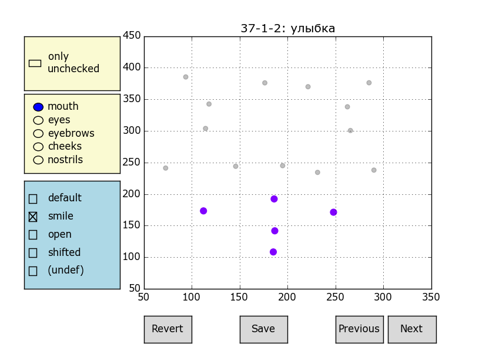
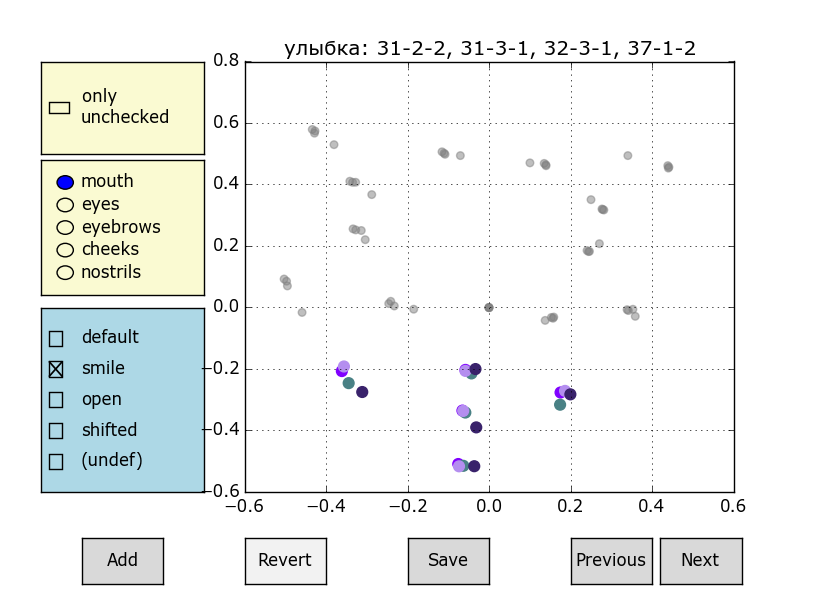

<html>
<head>
<h4 align="center">Emotion Area subproject</h4>
</head>

<body>

<table style="width:100%">
  <tr>
    <th>files</th>
    <th>info</th>
  </tr>

  <tr>
    <td>emotion_area.py</td>
    <td>EmotionArea: tracks particular face part</td>
  </tr>
  <tr>
    <td>em_area_setting.py</td>
    <td>training (setting) best parameters for each face area</td>
  </tr>
  <tr>
    <td>em_area_testing.py</td>
    <td>testing part</td>
  </tr>
  <tr>
    <td>inspector.py</td>
    <td>manual GUI to define face area action based on its tracked markers movements</td>
  </tr>
  <tr>
    <td>check_inspector.py</td>
    <td>GUI to check inspector results (loads only those files, which have more than one face area action)</td>
  </tr>
  <tr>
    <td>visualizer.py</td>
    <td>plots normalized (w.r.t. Emotion.preprocess) data from a few files of the same emotion class simultaneously</td>
  </tr>
  <tr>
    <td>preparation.py</td>
    <td>face areas splitter</td>
  </tr>

  <tr>
    <td>EMOTION_AREAS_INFO.json</td>
    <td>stores the weights for each marker of some face area</td>
  </tr>
  <tr>
    <td>face_structure_merged.json</td>
    <td>merged inspector cache</td>
  </tr>
</table>

</body>
</html>