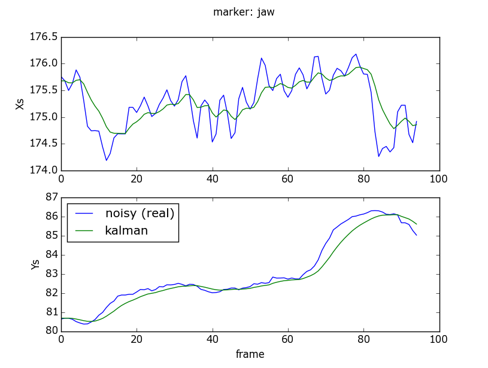
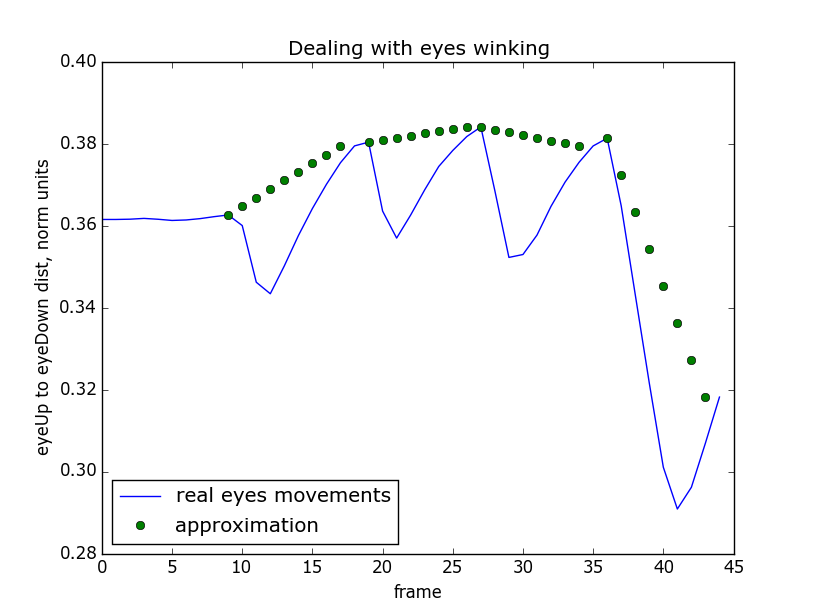

<html>
<head>
<h4 align="center">Emotion project</h4>
</head>

<body>

<table style="width:100%">
  <tr>
    <th>files</th>
    <th>info</th>
  </tr>

  <tr>
    <td>emotion.py</td>
    <td>Emotion: a BasicMotion class wrapper</td>
  </tr>
  <tr>
    <td>csv_reader.py</td>
    <td>reads csv data and dumps it into pickles</td>
  </tr>
  <tr>
    <td>em_setting.py</td>
    <td>emotion: training (setting) best parameters</td>
  </tr>
  <tr>
    <td>em_testing.py</td>
    <td>emotion: testing part</td>
  </tr>
  <tr>
    <td>excel_parser.py</td>
    <td>reads and modifies excel data</td>
  </tr>
  <tr>
    <td>valid_labels.txt</td>
    <td>list of 18 valid face marker names</td>
  </tr>
  <tr>
    <td>demo_tools.py</td>
    <td>demo of kalman filter tools</td>
  </tr>

  <tr>
    <td>description.xls</td>
    <td>tells about emotion class for each file name</td>
  </tr>
  <tr>
    <td>missed_data.xlsx</td>
    <td>info about missed emotions and incompatible data shapes</td>
  </tr>
  <tr>
    <td>EMOTION_INFO.json</td>
    <td>stores the weights and the last training results</td>
  </tr>

</table>

Data preprocessing steps:

<ol>
	<li> Subtracting nose position of the first frame from all markers.
	<li> Diving data by the base line -- from jaw to eyebrows center.
	<li> Kalman filter data restoration (see left picture below).
	<li> Dealing with eyes winking (see right picture below).
</ol>

<table>
	<tr>
		<td></td>
		<td></td>
	</tr>
</table>

The data were divided into training (42 samples) and testing (36 samples) sets with unproprotional number of samples for each emotion. Since the raw data is noisy and uncorrelated within the same class, weighted DTW algorithm performs poorly even with data smoothing. Thus, we need more friendly classifier to deal with slight data differentiation.

For this reason, simple neural network (NN) with one hidden layer and hyperbolic tanh activation function is used and yields the next results:

<table style="width:60%; margin:0 auto">
	<tr>
		<th>Algorithm</th>
		<th># correctly recognized samples</th>
	</tr>
	<tr>
		<td>WDTW</td>
		<td>0 / 36</td>
	</tr>
	<tr>
    	<td>NN</td>
		<td>31 / 36</td>
	</tr>

</table>

</body>
</html>