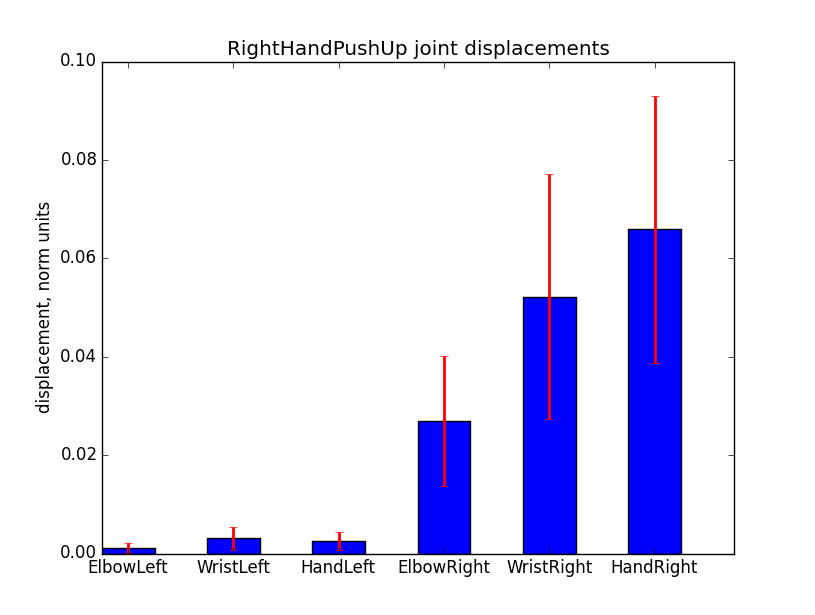
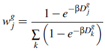
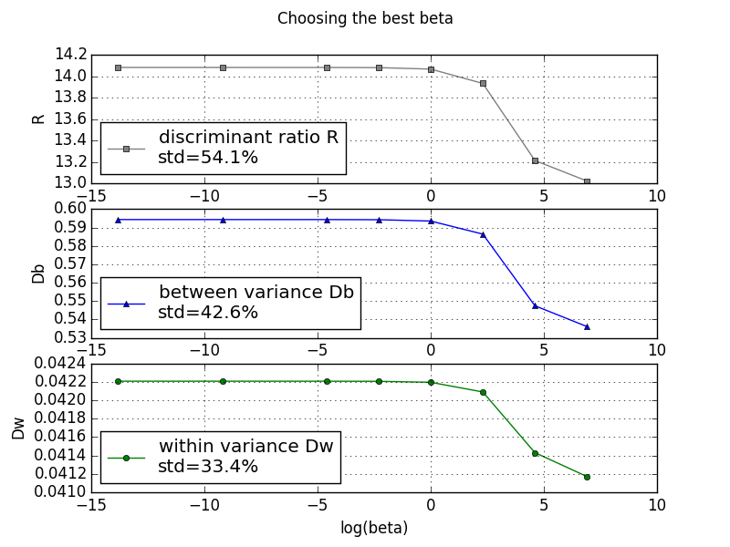

<html>
<head>
<h4 align="center">Kinect project</h4>
</head>

<body>

The main idea in gesture recognition is to maximize between class variance <i>Db</i> and minimize within class variance <i>Dw</i> by choosing appropriate hidden parameters (training step). For this purpose Weighted DTW algorithm has been <a href="http://datascience.sehir.edu.tr/pub/VISAPP2013.pdf">proposed</a>.

It's obvious, that a joint which is active in one gesture class may not be active in another gesture class. Hence weights have to be adjusted accordingly.
As Reyes et al. (2011) has observed, only six out of the 20 joints contribute in identifying a hand gesture: left hand, right hand, left wrist, right wrist, left elbow, right elbow. We propose to use only 3 of them, w.r.t. to the left or right hand.

For example, for the right-hand-push-up gesture, one would expect the right hand, right elbow and right wrist joints to have large weights, but to have smaller weights for the left-hand-push-up gesture.

The bar chart above can be interpreted as a contribution of each chosen joint. Using the total displacement values of joints, the joint <i>j</i>'s weight value of class <i>g</i> is calculated via

Best beta yields the biggest discriminant ratio <i>R = Db/Dw</i>. As shown below, the max(R) is obtained when beta vanishes.

When all hidden parameters are calculated and all weights are set for each gesture class, it's time to use WDTW to compare some unknown sequence (from a testing set) with a known one (from a training set).

Using only 3 crucial body joints (with other weights set to zero), all testing gesture characters from the <a href="http://datascience.sehir.edu.tr/visapp2013/">database</a> are classified correctly, while using all set of body joints (with constant weights) yields 22.5 % out-of-sample error.

</body>
</html>
