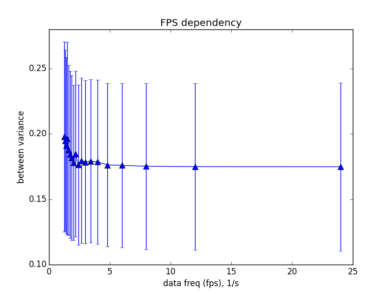

<html>
<head>
<h4 align="center">Mocap project</h4>
</head>

<body>

<table style="width:100%">
  <tr>
    <th>files</th>
    <th>info</th>
  </tr>

  <tr>
    <td>files_modifier.py</td>
    <td>changes orientation XYZ by default (Z should measure human height)</td>
  </tr>
  <tr>
    <td>mreader.py</td>
    <td>MoCap C3D files reader</td>
  </tr>
  <tr>
    <td>msetting.py</td>
    <td>MoCap training part</td>
  </tr>
  <tr>
    <td>mtesting.py</td>
    <td>MoCap testing part</td>
  </tr>
  <tr>
    <td>helper.py</td>
    <td>prints info about open C3D file</td>
  </tr>
  <tr>
    <td>labelling.py</td>
    <td>contains all 83 markers (labels) names with init (relaxed) frame for each C3D file</td>
  </tr>
  <tr>
    <td>math_kernel.py</td>
    <td>provides necessary math function</td>
  </tr>
  <tr>
    <td>splitter.py</td>
    <td>HumanoidUkrSplitter class implementation</td>
  </tr>
  <tr>
    <td>troubles_hunter.py</td>
    <td>checks split C3D files for having troubles and shows them if any</td>
  </tr>
  <tr>
    <td>dactyls.py</td>
    <td>provides manual instrument to split dactyls C3D files</td>
  </tr>
  <tr>
    <td>writer.py</td>
    <td>rewriting C3D file by changing its orientation, etc.</td>
  </tr>
  <tr>
    <td>valid_labels.txt</td>
    <td>list of 83 valid body joints names</td>
  </tr>
  <tr>
    <td>MOCAP_INFO.json</td>
    <td>includes the necessary info and chosen params for the MoCap project</td>
  </tr>
</table>

Given C3D files have too large points frequency (FPS = 120). It's a matter of fact, that between class variance <i>Db</i> does not much depend of the chosen frequency: omitting 90% of data (take each 12'th frame) gives  nearly the same between class variance -- as raw data do.

But we should not forget about the within class variance. Unfortunately, having only 1 training example per unique gesture, it's impossibly to compute this characteristic. It can turn out that with the FPS diminishing within class variance can go up, ipso facto reducing the discriminant ratio <i>R = Db / Dw</i>. 

</body>
</html>