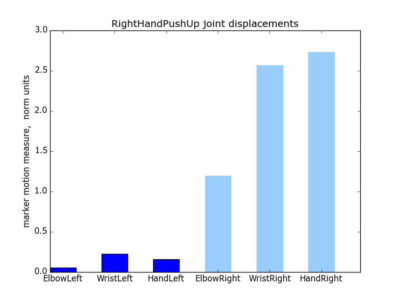
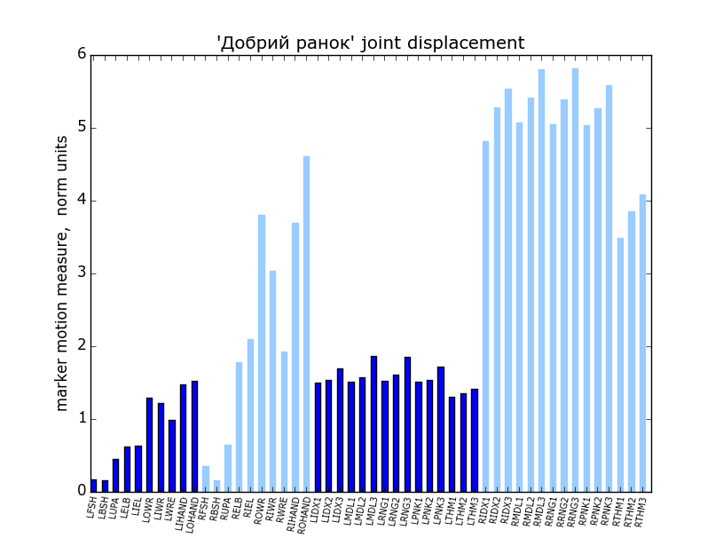
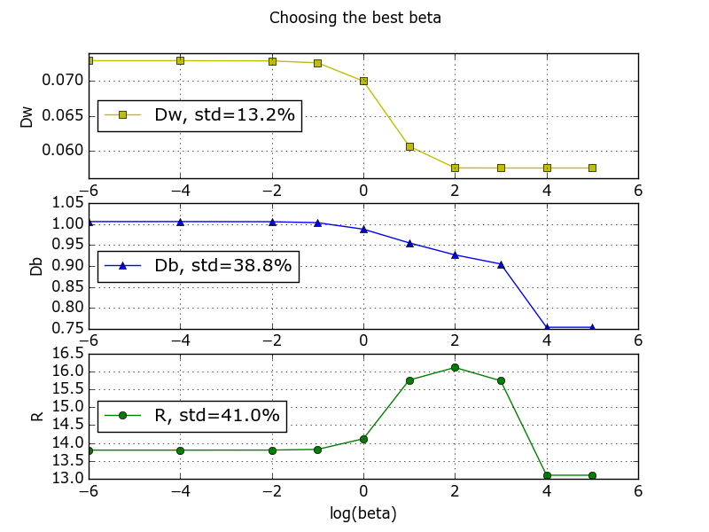
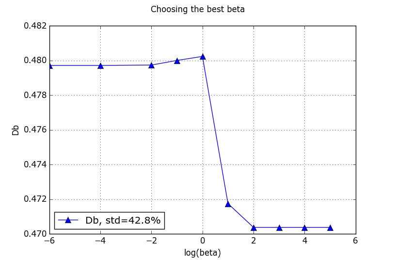
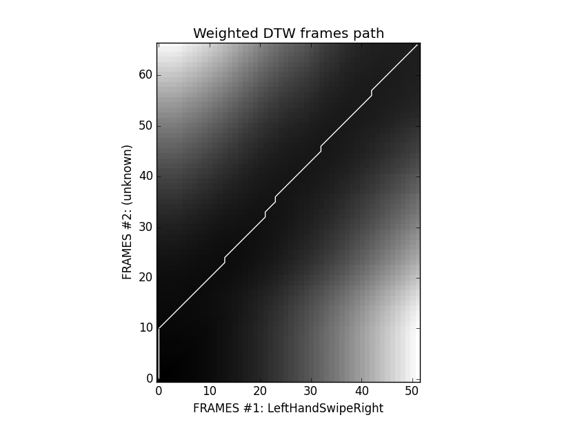
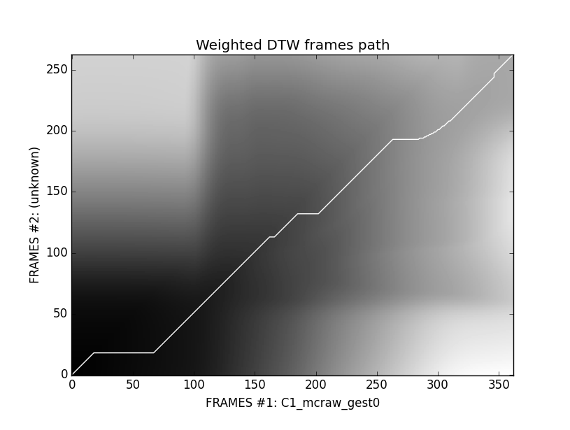
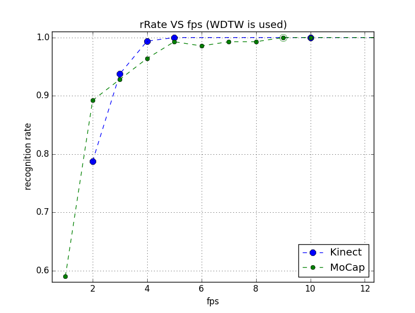

<html>
<head>

<h1 align="center">Sign language</h1>
</head>

<body>

<i>This repo provides the instruments for classification of signle signs and basic human emotions.</i>

<nav class="contents">
  <h2>Contents </h2>
  <ol>
    <li><a href="#info">Projects info</a></li>
	<li><a href="#art">State of art</a></li>
	<li><a href="#preprocess">Data preprocessing</a></li>
	<li><a href="#displacements">Body joint displacements</a></li>
	<li><a href="#weights">Body joint weights. Discriminant ratio</a></li>
	<li><a href="#wdtw">Weighted DTW comparison</a></li>
	<li><a href="#tools">Packages</a></li>
  </ol>
</nav>

<video controls>
  <source src="video_example.mp4" type="video/mp4">
</video>

<h2 id="info">Projects info</h2>
<ul>
  <li>MoCap (Graphics Lab Motion Capture):
    <ul>
      <li>covers common Ukrainian gestures</li>
      <li>file type: c3d</li>
      <li>body joints: 83</li>
      <li>data is measured in millimeters</li>
      <li>FPS: 120</li>
      <li>unique gesture classes: 139</li>
      <li>samples per gesture: 2</li>
    </ul>
  </li>
  <li><a href="http://datascience.sehir.edu.tr/visapp2013">Kinect</a>:</li>
    <ul>
      <li>covers basic hand motions</li>
      <li>file type: txt</li>
      <li>body joints: 20</li>
      <li>data is measured in meters</li>
      <li>FPS: 30</li>
      <li>unique gesture classes: 8</li>
      <li>samples per gesture: 28</li>
    </ul>
  <li>Emotion:
    <ul>
      <li>covers basic human facial emotions</li>
      <li>file type: blend --> csv --> pkl</li>
      <li>facial joints: 18</li>
      <li>data is measured in pixels</li>
      <li>FPS: 24</li>
      <li>unique gesture classes: 9</li>
      <li>samples per gesture: 3 ... 27</li>
    </ul>
</ul>

<b>Notes</b>. The Kinect project is based on <a href="http://datascience.sehir.edu.tr/pub/VISAPP2013.pdf">this</a> paper and their <a href="http://datascience.sehir.edu.tr/visapp2013/WeightedDTW-Visapp2013-DB.rar">data</a> to compare its results with our MoCap project. Below is shown a skeleton of using Weighted DTW algorithm for MoCap and Kinect projects.

If you want to see the results of facial emotion recognition, go to <i>Emotion</i> folder.

<h2 id="art">State of art</h2>

The main idea in gesture recognition is to maximize between class variance <i>Db</i> and minimize within class variance <i>Dw</i> by choosing appropriate hidden parameters (training step). For this purpose Weighted DTW algorithm has been <a href="http://datascience.sehir.edu.tr/pub/VISAPP2013.pdf">proposed</a>.

It's obvious, that a joint which is active in one gesture class may not be active in another gesture class. Hence weights have to be adjusted accordingly.
As Reyes et al. (2011) have observed, only six out of the 20 joints contribute in identifying a hand gesture: left hand, right hand, left wrist, right wrist, left elbow, right elbow. For example, for the right-hand-push-up gesture, one would expect the right hand, right elbow and right wrist joints to have large weights, but to have smaller weights for the left-hand-push-up gesture. We propose to use only 3 of them, w.r.t. to the left or right hand.

<h2 id="preprocess">Data preprocessing</h2>

Data preprocessing for both projects includes 2 steps:

<ol>
    <li>Subtracting the shoulder center from all joints, which accounts for cases where the user is not in the center of the depth image.</li>
    <li>Normalizing the data with the distance between the left and the right shoulders to account for the variations due to the person's size.</li>
</ol>

<h2 id="displacements">Body joint displacements</h2>

The main difference between MoCap and Kinect projects is the number of body joints (marker) that are active during the motion. Thus, Kinect project provides only 6 hand markers while MoCap projects operates with 50 (25 x 2) hand markers. Their contribution in the motion is shown below as a  joint's displacement sum over gesture frames (measured in normalized units).

<table style="width:100%">
	<tr>
		<th>Kinect</th>
		<th>MoCap</th>
	<tr>
    <tr>
        <td>
            
        </td>
        <td>
            
        </td>
    </tr>
</table>

<h2 id="weights">Body joint weights. Discriminant ratio</h2>

Using the total displacement values of joints, the joint <i>j</i>'s weight value of class <i>g</i> is calculated via 

where  is the <i>j'</i>s joint total displacement, averaged over all training samples in the gesture class "<i>g</i>",  is a hidden parameter. 

Total displacement of the joint "<i>j</i>" in one example is computed by

where  is a <i>j'</i>s joint position in the  frame "<i>i</i>".

Best  yields the biggest discriminant ratio . In our case, although within variance <i>Dw</i> goes up with the  decreasing, the  is obtained when   vanishes. That means

<table style="width:100%">
	<tr>
		<th>Kinect</th>
		<th>MoCap</th>
	<tr>
    <tr>
        <td>
            
        </td>
        <td>
            
        </td>
    </tr>
</table>

The secondary difference between the projects is that MoCap has only 1 training example and 1 testing example per unique gesture, while Kinect provides 20 training and 8 testing ones. Thus, we cannot compute the within class variance for the MoCap project -- only between class variance is availible for demonstration confidence measure (or discriminant ratio).

<h2 id="wdtw">Weighted DTW comparison</h2>

When all hidden parameters are calculated and all weights are set for each gesture class, it's time to use WDTW to compare some unknown sequence (from a testing set) with a known one (from a training set).

<table style="width:100%">
	<tr>
		<th>Kinect</th>
		<th>MoCap</th>
	<tr>
    <tr>
        <td>
            
        </td>
        <td>
            
        </td>
    </tr>
</table>

Using weighted DTW algorithm with only 3 crucial (hand) body joints for Kinect project (with other weights set to zero), all testing gesture characters from the <a href="http://datascience.sehir.edu.tr/visapp2013/">database</a> are classified correctly, while simple (unweighted) DTW algorithm with the same 3 body joints yields 22.5% out-of-sample error.

<table style="width:60%; margin:0 auto">
	<caption><i>Single gesture recognition accuracy, % </i></caption>
	<tr>
		<th rowspan="2">Algorithm</th>
		<th colspan="2">Data base</th>
	</tr>
	<tr>
		<td>MoCap</td>
		<td>Kinect</td>
	</tr>
	<tr>

    	<td>WDTW</td>
		<td>100 %</td>
		<td>100 %</td>
	</tr>
	<tr>
    	<td>DTW</td>
		<td>100 %</td>
		<td>77.5 %</td>
	</tr>
</table>

At the same time, MoCap's simple DTW yields the same result (100% recognition accuracy) as the weighted one. It's because, firstly,  there is only 1 training and 1 testing example per unique gesture in MoCap project and, secondly, training and testing gestures were performed by the same skilled signer. Thus, training and testing examples are nearly identical.

<h2 id="rrate">FPS dependency</h2>

Another interesting observation shows that there is no need to use the whole dense data to be able to correctly classify it. For instance, using weighted DTW, setting FPS = 10 is enough for both projects data.

	

<h2 id="tools">Packages</h2>

Free 3D Graphics Lab Motion Capture visualizers:

<ul>
  <li><a href="http://b-tk.googlecode.com/svn/web/mokka/index.html">Mokka</a></li>
  <li><a href="http://www.blender.org/">Blender</a> (look at <a href="http://stackoverflow.com/questions/20499320/how-to-import-c3d-files-into-blender">here</a> to be able to import C3D files)</li>
  <li><a href="http://www.c-motion.com/free-downloads/">Free CMO Reader</a></li>
</ul>

The current project is portable: although it's built and maintained upon Python 3.4 x32 version, you can use 2.7.8 or higher 32 bit version of Python.

Obligatory Python </a> packages (can be found at <a href="http://www.lfd.uci.edu/~gohlke/pythonlibs">http://www.lfd.uci.edu/~gohlke/pythonlibs)</a>:

<ul>
  <li><a href="https://github.com/EmbodiedCognition/py-c3d">c3d</a> to read and display c3d contents (<b>Note</b>: if you use Python 2.7.x, install also native <a href="http://code.google.com/p/b-tk/downloads/detail?name=python-btk-0.3.0_win32.exe">Biomechanical ToolKit</a>)</li>
  <li>for pretty animation like in OpenGL:
	<ul>
		<li><a href="http://github.com/lmjohns3/py-cli">climate</a></li>
		<li><a href="http://www.lfd.uci.edu/~gohlke/pythonlibs/#curses">curses</a></li>
		<li><a href="http://pyglet.readthedocs.org/en/pyglet-1.2-maintenance">pyglet</a></li>
	</ul>
  </li>
  <li><a href="http://sourceforge.net/projects/matplotlib/files/matplotlib/matplotlib-1.4.2/windows/matplotlib-1.4.2.win32-py2.7.exe/download">matplotlib</a> (with <i>pyparsing</i>, <i>dateutil</i>, <i>setuptools</i> and <i>six</i>)</li>
  <li><a href="http://sourceforge.net/projects/numpy/files/NumPy/1.9.1/numpy-1.9.1-win32-superpack-python2.7.exe/download">numpy</a></li>
  <li><a href="https://pypi.python.org/pypi/dtw/1.0">dtw</a> (dynamic time warping)</li>
  <li>(optional) <a href="http://sourceforge.net/projects/pywin32">win32com</a> module to work with Microsoft Excel files</li>
</ul>

</body>
</html>
