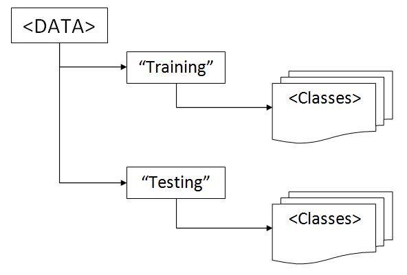

# Sign language recognition

###### This repo provides the instruments for signle signs and facial emotions recognition.

1. [Quick start](#quick-start)
2. [In-depth start](#in-depth-start)
3. [Dependencies](#dependencies)

For gained recognition accuracy go to [results](results) session. 

## Quick start

Firstly, install [dependencies](#dependencies).

Secondly, inside `GesturesSpeech` folder type one of the following:

	$ python -m MOCAP.mreader
	$ python -m Kinect.kreader
	$ python -m Emotion.em_reader

## In-depth start

There is three independent projects:

* MoCap
* Kinect
* Emotion

 To run one of them,

1. Make sure you've completely installed all [obligatory Python packages](#dependencies).
2. If you're about to run MoCap project, you need to
    - get [permission](https://github.com/dizcza/GesturesSpeech/tree/dev/MOCAP/_data). Otherwise, only one c3d sample is available.
    - set up a path to the downloaded MoCap database.
	
	> Each `[PREFIX]reader.py` initializes a constant `PROJECTNAME_PATH` -- a path to data directory for the current PROJECTNAME, -- where [PREFIX] is the first character of the PROJECTNAME. So you have to change that constant. Keep in mind, that the chosen data directory should preserve the original structure, used in a project: 

3. Decide which project part do you want to run: 
	- `[PREFIX]reader.py` -- data demonstration (visualization);
	- `[PREFIX]setting.py` -- WDTW training;
	- `[PREFIX]test.py` -- WDTW testing.

	Whether it's a reader, setting or a testing script file, you can run it through Python IDE ([PyCharm](https://www.jetbrains.com/pycharm/) is used here) or via cmd by typing `$ python -m PROJECTNAME.filename` (without a `.py`) inside a global project directory, which is  `GesturesSpeech` -- repository name. For example, type
  
		$ python -m Kinect.kreader
  
	to run Kinect demo.

The project is portable: both **Windows 7** and **Linux** are supported. Also you can easily switch from Python 2.7 to Python 3.4 and vice versa.

If you use Python 2.7, make sure you don't have non-ascii characters in your path to clone the project in. Some python-2.7 modules (such as [pyglet](http://pyglet.readthedocs.org)) may not work with module param `-m` and cyrillic characters in path at the same time.

#### Tested on:
* Windows 7 SP1 x64 + Python 3.4.3 x32 (also with Python 2.7.10 x32)
* Ubuntu 14.04.3 x64 + Python 2.7 x64 (built-in)

## Dependencies

*   [c3d](https://github.com/EmbodiedCognition/py-c3d) to read and display c3d contents (Note: if you use Python 2.7.x, install also native [Biomechanical ToolKit](https://code.google.com/p/b-tk/downloads/list))
*   for pretty animation like in OpenGL:
    *   [climate](http://github.com/lmjohns3/py-cli)
    *   [curses](http://www.lfd.uci.edu/~gohlke/pythonlibs/#curses) (necessary only for Windows 7 users)
    *   [pyglet](http://pyglet.readthedocs.org)
*   [matplotlib](http://sourceforge.net/projects/matplotlib)
*   [numpy](http://sourceforge.net/projects/numpy)
*   [dtw](https://pypi.python.org/pypi/dtw) [dynamic time warping] is only for illustration purpose (I used [FastDTW](https://github.com/slaypni/fastdtw) modification)
*   [tqdm](https://github.com/tqdm/tqdm) progress bar
*   [rarfile](https://github.com/markokr/rarfile) to unrar downloaded Kinect database.rar
*   (optional in [Emotion project](https://github.com/dizcza/GesturesSpeech/tree/dev/Emotion) for Windows 7 users) [win32com](http://sourceforge.net/projects/pywin32) and [unidecode](https://pypi.python.org/pypi/Unidecode) moduli to parse unicode data from Microsoft Excel files.