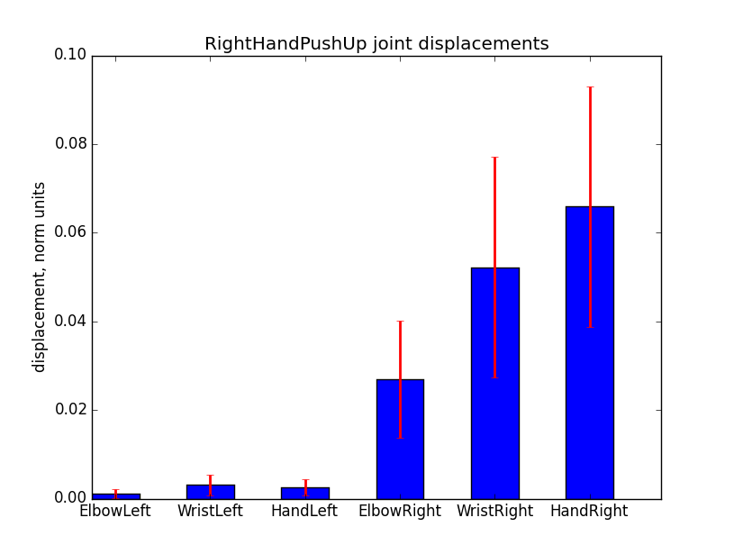
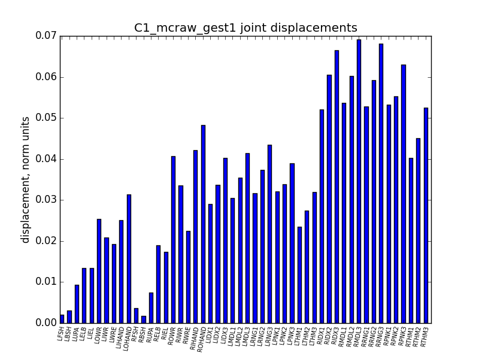
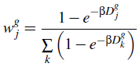
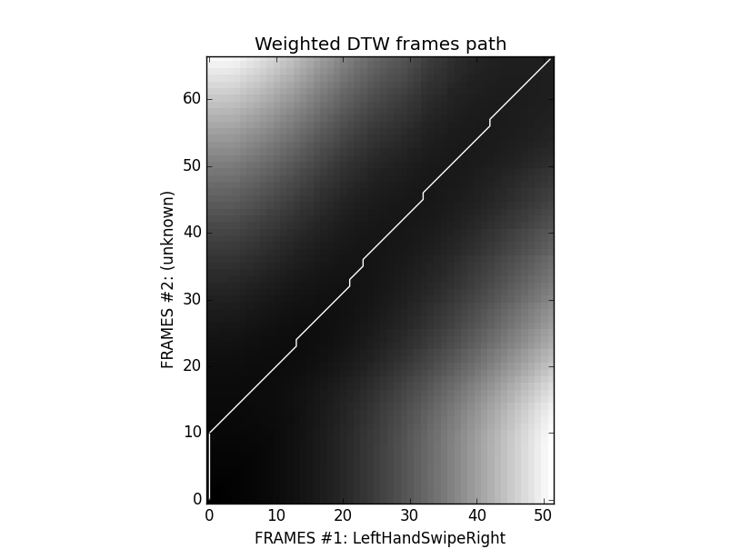
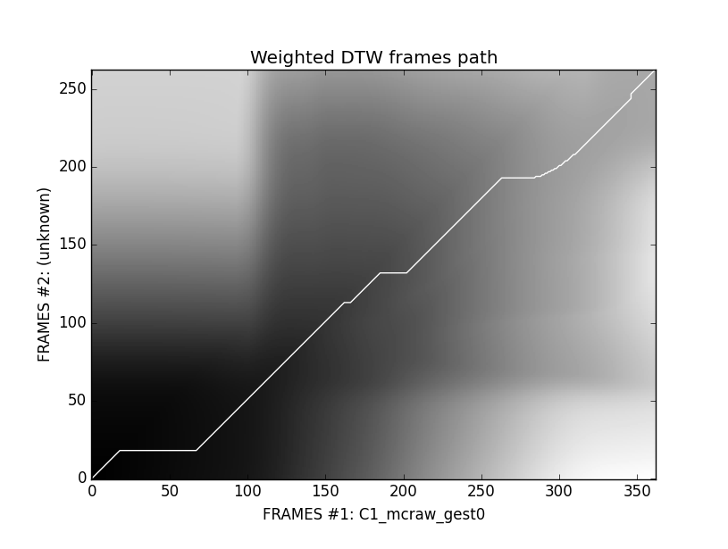

<html>
<head>
<h3 align="center">GesturesSpeech</h3>
</head>

<body>

<i>This repo provides the instruments for both projects:
(1) Ukrainian gestures, captured with MoCap C3D technology, and (2) basic hand motions,
captured with Microsoft Kinect sensor.</i>

<video controls>
  <source src="video_example.mp4" type="video/mp4">
</video>

Projects kernel summary:

<table style="width:100%">
  <tr>
    <th>script</th>
    <th>file info</th>
  </tr>
  <tr>
    <td>humanoid</td>
    <td>HumanoidBasic class: super class for both projects</td>
  </tr>
  <tr>
    <td>gDTW</td>
    <td>gesture weighted DTW algorithm implementation</td>
  </tr>
</table>

<h6>Projects info:</h6>
<ul>
  <li>MoCap (Motion Capture):
    <ul>
      <li>covers common Ukrainian gestures</li>
      <li>file type: c3d</li>
      <li>body joints: 83</li>
      <li>data is measured in millimeters</li>
      <li>FPS: 120</li>
      <li>unique gesture classes: ~150</li>
      <li>samples per gesture: 2</li>
    </ul>
  </li>
  <li><a href="http://datascience.sehir.edu.tr/visapp2013">Kinect<a/>:</li>
    <ul>
      <li>covers basic hand motions</li>
      <li>file type: txt</li>
      <li>body joints: 20</li>
      <li>data is measured in meters</li>
      <li>FPS: 30</li>
      <li>unique gesture classes: 8</li>
      <li>samples per gesture: 28</li>
    </ul>
</ul>

Note: the Kinect project is based on <a href="http://datascience.sehir.edu.tr/pub/VISAPP2013.pdf">this</a> paper and their <a href="http://datascience.sehir.edu.tr/visapp2013/WeightedDTW-Visapp2013-DB.rar">data</a> to compare its results with our MoCap project.

The main idea in gesture recognition is to maximize between class variance <i>Db</i> and minimize within class variance <i>Dw</i> by choosing appropriate hidden parameters (training step). For this purpose Weighted DTW algorithm has been <a href="http://datascience.sehir.edu.tr/pub/VISAPP2013.pdf">proposed</a>.

It's obvious, that a joint which is active in one gesture class may not be active in another gesture class. Hence weights have to be adjusted accordingly.
As Reyes et al. (2011) has observed, only six out of the 20 joints contribute in identifying a hand gesture: left hand, right hand, left wrist, right wrist, left elbow, right elbow. For example, for the right-hand-push-up gesture, one would expect the right hand, right elbow and right wrist joints to have large weights, but to have smaller weights for the left-hand-push-up gesture. We propose to use only 3 of them, w.r.t. to the left or right hand.

The main difference between MoCap and Kinect projects is the number of body joints (marker) that are active during the motion. Thus, Kinect project provides only 6 hand markers while MoCap projects operates with 50 (25 x 2) hand markers. Their contribution in the motion is shown below as an average joint's displacement per frame (measured in normalized units).

<table style="width:100%">
	<tr>
		<th>Kinect</th>
		<th>MoCap</th>
	<tr>
    <tr>
        <td>
            
        </td>
        <td>
            
        </td>
    </tr>
</table>

Data preprocessing includes 2 steps:

<ol>
    <li>Subtracting the shoulder center from all joints, which accounts for cases where the user is not in the center of the depth image.</li>
    <li>Normalizing the data with the distance between the left and the right shoulders to account for the variations due to the person's size.</li>
</ol>

Using the total displacement values of joints, the joint <i>j</i>'s weight value of class <i>g</i> is calculated via

Best beta yields the biggest discriminant ratio <i>R = Db/Dw</i>. As shown below, the max(<i>R</i>) is obtained when beta vanishes.

<table style="width:100%">
	<tr>
		<th>Kinect</th>
		<th>MoCap</th>
	<tr>
    <tr>
        <td>
            
        </td>
        <td>
            
        </td>
    </tr>
</table>

The second difference between the projects is that MoCap has only 1 training example and 1 testing example per unique gesture, while Kinect provides 20 training and 8 testing ones. Thus, we cannot compute the within class variance for the MoCap project -- only between class variance is availible for demonstration confidence measure (or discriminant ratio).

When all hidden parameters are calculated and all weights are set for each gesture class, it's time to use WDTW to compare some unknown sequence (from a testing set) with a known one (from a training set).

<table style="width:100%">
	<tr>
		<th>Kinect</th>
		<th>MoCap</th>
	<tr>
    <tr>
        <td>
            
        </td>
        <td>
            
        </td>
    </tr>
</table>

Using weighted DTW algorithm with only 3 crucial (hand) body joints for Kinect project (with other weights set to zero), all testing gesture characters from the <a href="http://datascience.sehir.edu.tr/visapp2013/">database</a> are classified correctly, while simple (unweighted) DTW algorithm with the same 3 body joints yields 22.5% out-of-sample error.

At the same time, in MoCap project simple DTW yields the same result (100% recognition accuracy) as the weighted one. It's because, firstly,  there is only 1 training and 1 testing example per unique gesture in MoCap project and, secondly, training and testing gestures were performed by the same skilled signer. Thus, training and testing examples are nearly identical.

Free 3D Motion Capture visualizers:

<ul>
  <li><a href="http://b-tk.googlecode.com/svn/web/mokka/index.html">Mokka</a></li>
  <li>A powerful <a href="http://www.blender.org/">Blender</a> suite (look at <a href="http://stackoverflow.com/questions/20499320/how-to-import-c3d-files-into-blender">here</a> to be able to import C3D files)</li>
  <li><a href="http://www.c-motion.com/free-downloads/">Free CMO Reader</a></li>
</ul>

Obligatory <a href="https://www.python.org/ftp/python/2.7/python-2.7.msi">Python 2.7</a> packages (can be found at http://www.lfd.uci.edu/~gohlke/pythonlibs/):

<ul>
  <li><a href="http://code.google.com/p/b-tk/downloads/detail?name=python-btk-0.3.0_win32.exe">The Biomechanical ToolKit</a>
  		to read and modify data from C3D files</li>
  <li><a href="http://sourceforge.net/projects/matplotlib/files/matplotlib/matplotlib-1.4.2/windows/matplotlib-1.4.2.win32-py2.7.exe/download">matplotlib</a> (with <b>pyparsing</b>, <b>dateutil</b>, <b>pytz</b> and <b>six</b>)</li>
  <li><a href="http://sourceforge.net/projects/numpy/files/NumPy/1.9.1/numpy-1.9.1-win32-superpack-python2.7.exe/download"> 		numpy</a></li>
  <li><a href="https://pypi.python.org/pypi/dtw/1.0">dtw</a> (dynamic time warping)</li>
</ul>

</body>
</html>
