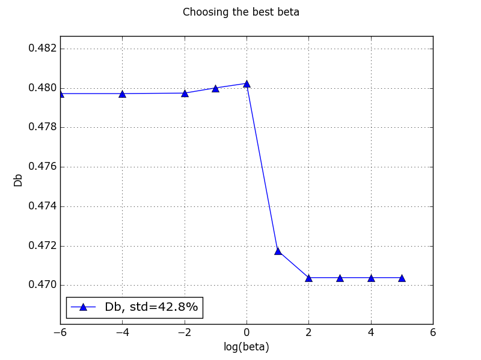

# Sign language recognition

###### This repo provides the instruments for signle signs and facial emotions recognition.

## Contents
1.  [Projects info](#projects-info)
2.  [**How to run a project**](#how-to-run-a-project)
3.  [Class diagram](#class-diagram)
4.  [State of art](#state-of-art)
5.  [Data pre-processing](#data-pre-processing)
6.  [Body joint displacements](#body-joint-displacements)
7.  [Body joint weights. Discriminant ratio](#body-joint-weights-discriminant-ratio)
8.  [The worst and the best testing scenarios](#the-worst-and-the-best-testing-scenarios)
9.  [Weighted DTW comparison](#weighted-dtw-comparison)
10. [Results](#results)
11. [FPS dependency](#fps-dependency)
11. [Tools](#tools)

## Projects info

<table style="width:100%; margin:0 auto">
	<tr>
		<th rowspan="2"></th>
		<th colspan="3">Data base</th>
	</tr>
	<tr>
		<td>MoCap</td>
		<td><a href="http://datascience.sehir.edu.tr/visapp2013">Kinect</a></td>
		<td><a href="https://github.com/dizcza/GesturesSpeech/tree/dev/Emotion/_data">Emotion</a></td>
	</tr>
	<tr>
    	<td>contents</td>
		<td>common Ukrainian gestures</td>
		<td>basic hand motions</td>
		<td>facial emotions</td>
	</tr>
	<tr>
    	<td>data type</td>
		<td>c3d</td>
		<td>txt</td>
		<td>blend --> csv --> pkl</td>
	</tr>
	<tr>
    	<td>data dimension</td>
		<td>3D</td>
		<td>3D</td>
		<td>2D</td>
	</tr>
	<tr>
    	<td>data is measured in</td>
		<td>millimeters</td>
		<td>meters</td>
		<td>pixels</td>
	</tr>
	<tr>
    	<td># markers</td>
		<td>83</td>
		<td>20</td>
		<td>18</td>
	</tr>
	<tr>
    	<td># active markers</td>
		<td>50</td>
		<td>6</td>
		<td>18</td>
	</tr>
	<tr>
    	<td>FPS</td>
		<td>120</td>
		<td>30</td>
		<td>24</td>
	</tr>
	<tr>
    	<td>unique gestures</td>
		<td>139</td>
		<td>8</td>
		<td>9</td>
	</tr>
	<tr>
    	<td>samples per gesture</td>
		<td>2</td>
		<td>28</td>
		<td>3 ... 27</td>
	</tr>
	<tr>
    	<td>train dataset size</td>
		<td>1 x 139 = 139</td>
		<td>8 x 8 = 64</td>
		<td>42</td>
	</tr>
	<tr>
    	<td>test dataset size</td>
		<td>1 x 139 = 139</td>
		<td>20 x 8 = 160</td>
		<td>36</td>
	</tr>
	<tr>
    	<td># actors</td>
		<td>1</td>
		<td>unknown</td>
		<td>3</td>
	</tr>
</table>

**Notes**:

1.  The Kinect project is based on [this](http://datascience.sehir.edu.tr/pub/VISAPP2013.pdf) paper and their [data](http://datascience.sehir.edu.tr/visapp2013/WeightedDTW-Visapp2013-DB.rar) to compare its results with our MoCap project.
2.  _Active markers_ are the ones that carry information about the motion body parts. Hence we don't need to track them all. This parameter is set manually for each project.
3.  Number of _actors_ is the number of humans, who were involved directly into data acquisition.
4.  For simplicity and generality, each facial emotion can be viewed and called as a gesture.

## How to run a project

To run a particular project (_MoCap_, _Kinect_ or _Emotion_), 

1. Make sure you've completely installed all [obligatory Python packages](#tools).
2. If you're about to run MoCap project, you need to
    - get [permission](https://github.com/dizcza/GesturesSpeech/tree/dev/MOCAP/_data). Otherwise, only one c3d sample is available.
    - set up a path to the downloaded MoCap database.
	
	> Each `[PREFIX]reader.py` initializes a constant `PROJECTNAME_PATH` -- a path to data directory for the current PROJECTNAME, -- where [PREFIX] is the first character of the PROJECTNAME. So you have to change that constant. Keep in mind, that the chosen data directory should preserve the original structure, used in a project: 

3. Decide which project part do you want to run: 
	- `[PREFIX]reader.py` -- data demonstration (visualization);
	- `[PREFIX]setting.py` -- WDTW training;
	- `[PREFIX]test.py` -- WDTW testing.

	Whether it's a reader, setting or a testing script file, you can run it through Python IDE ([PyCharm](https://www.jetbrains.com/pycharm/) is used here) or via cmd by typing `$ python -m PROJECTNAME.filename` (without a `.py`) inside a global project directory, which is  `GesturesSpeech` -- repository name. For example, type
  
		$ python -m Kinect.kreader
  
	to run Kinect demo.

## Class diagram

## State of the art

The main idea in gesture recognition is to maximize between-class variance _Db_ and minimize within-class variance _Dw_ by choosing appropriate hidden parameters (training step). For this purpose Weighted DTW algorithm has been [proposed](http://datascience.sehir.edu.tr/pub/VISAPP2013.pdf).

It's obvious, that a joint which is active in one gesture class may not be active in another gesture class. Hence weights have to be adjusted accordingly. As Reyes et al. (2011) have observed, only six out of the 20 joints contribute in identifying a hand gesture: left hand, right hand, left wrist, right wrist, left elbow, right elbow. For example, for the right-hand-push-up gesture, one would expect the right hand, right elbow and right wrist joints to have large weights, but to have smaller weights for the left-hand-push-up gesture. We propose to use only 3 of them, w.r.t. to the left or right hand.

## Data pre-processing

Data pre-processing for MoCap and Kinect projects includes 2 steps:

1.  Subtracting the shoulder center from all joints, which accounts for cases where the user is not in the center of the depth image.
2.  Normalizing the data with the distance between the left and the right shoulders to account for the variations due to the person's size.

Additionally, besides these two steps, Emotion data pre-processing includes also slope aligning, Kalman filtering and dealing with eyes blinking.

## Body joint displacements

Except datasets sizes, the main difference between MoCap and Kinect projects is the number of body joints (marker) that are active during the motion. Thus, Kinect project provides only 3 markers per hand while MoCap project operates with 50 (25 x 2) hand markers. Their contribution in the motion (or their activity) is shown below as a joint's displacement sum over gesture frames (measured in normalized units) with right hand highlighted in light blue colour for Kinect sample and left hand - for MoCap sample, shown above as an animation of Ukrainian gesture "Добрий ранок". For Emotion project, a _smile_ sample was taken with mouth markers highlighted in light blue.

<table style="width:100%">
	<tr>
		<th>Kinect</th>
		<th>MoCap</th>
		<th>Emotion</th>
	<tr>
    <tr>
        <td>
            
        </td>
        <td>
            
        </td>
		<td>
            
        </td>
    </tr>
</table>

## Body joint weights. Discriminant ratio

Using the total displacement values of joints, the joint **_j_**'s weight value of class **_g_** is calculated via

where  is the **_j_**'s joint total displacement, averaged over all training samples in the gesture class **_g_** , and  is a hidden parameter.
Total displacement of the joint **_j_** in one example is computed by

where  is a **_j_**'s joint position in the **_i_**'s frame.

Best  yields the biggest discriminant ratio . In our case, the maximal **_R_** obtains when beta vanishes. That means 

<table style="width:100%">
	<tr>
		<th>Kinect</th>
		<th>MoCap</th>
		<th>Emotion</th>
	<tr>
    <tr>
        <td>
            
        </td>
        <td>
            
        </td>
		<td>
            
        </td>
    </tr>
</table>

Note, that MoCap has only 1 training example and 1 testing example per unique gesture, while Kinect provides 20 training and 8 testing ones. Thus, we cannot compute the within-class variance for the MoCap project -- only between-class variance is availible for the discriminant ratio demonstration.

## The worst and the best testing scenarios

The WORST test scenario is passed (with OK status) when the **max** DTW cost (or its modification) among the test sample "c" and all THE SAME class train samples  is lower than the min DTW cost among the test sample "c" and all OTHER classes samples  :

The BEST test scenario is passed (with OK status) when the **min** DTW cost (or its modification) among the test sample "c" and all THE SAME class train samples is lower than the min DTW cost among the test sample "c" and all OTHER classes samples :

It should be clear that the best scenario is also a _classic_ scenario at finding the best fitted known pattern to unknown test sample.

## Weighted DTW comparison

When all hidden parameters are calculated and all weights are set for each gesture class, it's time to use WDTW to compare some unknown sequence (from a testing set) with a known one (from a training set).

Classical DTW algorithm takes  complexity both in time and space. Using [FastDTW](http://cs.fit.edu/~pkc/papers/tdm04.pdf) [implementation](https://github.com/slaypni/fastdtw) speeds it up to linear complexity both in time and space. Although FastDTW introduces an error via changing controlling parameter, called radius **_r_**, it turns out that in our case FastDTW yields the same accuracy as DTW does.

| Kinect                       | MoCap                       |
| ---------------------------- | ----------------------------|
|  |  |

## Results

Using Weighted DTW algorithm with only 6 crucial (both hands) body joints for Kinect project (with other weights set to zero), all test gestures were classified correctly, while simple (unweighted) DTW algorithm with the same 6 body joints yields 21.2% out-of-sample error in the best case scenario for Kinect project.

<table style="width:100%">
	<caption><i>Single gesture recognition accuracy, % </i></caption>
	<tr>
		<th rowspan="3">Algorithm</th>
		<th colspan="6">Data base</th>
	</tr>
	<tr>
		<td colspan="2" align="center">MoCap</td>
		<td colspan="2" align="center">Kinect</td>
		<td colspan="2" align="center">Emotion</td>
	</tr>
	<tr>
    	<td>worst</td>
		<td>best</td>
		<td>worst</td>
		<td>best</td>
		<td>worst</td>
		<td>best</td>
	</tr>
	<tr>
    	<td>WDTW</td>
		<td>100</td>
		<td>100</td>
		<td>100</td>
		<td>100</td>
		<td>0</td>
		<td>80.6</td>
	</tr>
	<tr>
    	<td>DTW</td>
		<td>100</td>
		<td>100</td>
		<td>69.4</td>
		<td>78.8</td>
		<td>0</td>
		<td>83.3</td>
	</tr>
</table>

At the same time, MoCap's simple DTW yields the same result (100% recognition accuracy) as the weighted one. It's because, firstly, there is too much information per MoCap sample (too high FPS and too many markers) and, secondly, training and testing gestures were performed by the same skilled signer. Thus, training and testing examples are nearly identical.

WDTW algorithm correctly identified 29 / 36 emotions, while simple DTW identified 30 / 36\. The difference in 1 correctly recognized sample doesn't make a weather. Nevertheless, the explanation lies in the variation of pre-defined markers on the face, sensory noise and variations of facial expressions for the same emotion.

## FPS dependency

Another interesting observation shows that there is no need to use the whole dense data to be able to correctly classify it. For instance, using weighted DTW, setting FPS = 8 is enough for both projects data.

## Tools

Free 3D Graphics Lab Motion Capture visualizers (you probably don't have access to our C3D data set, so skip it):

*   [Mokka](http://b-tk.googlecode.com/svn/web/mokka/index.html) - my favourite; just make sure your data path uses only standard ASCII characters (they do not support extended ASCII character set);
*   [Blender](http://www.blender.org/) (look at [here](http://stackoverflow.com/questions/20499320/how-to-import-c3d-files-into-blender) to be able to import C3D files);
*   [CMO Reader](http://www.c-motion.com/free-downloads/#did4).

The project is portable: both **Windows 7** and **Linux** are supported. Also you can easily switch from Python 2.7 to Python 3.4 and vice versa.

If you use Python 2.7, make sure you don't have non-ascii characters in your path to clone the project. Some python-2.7 modules (such as [pyglet](http://pyglet.readthedocs.org)) may not work with module param `-m`.

#### Tested on:
* Windows 7 SP1 x64 + Python 3.4.3 x32 (also with Python 2.7.10 x32)
* Ubuntu 14.04.3 x64 + Python 2.7 x64 (built-in)

#### Obligatory Python packages

*   [c3d](https://github.com/EmbodiedCognition/py-c3d) to read and display c3d contents (Note: if you use Python 2.7.x, install also native [Biomechanical ToolKit](https://code.google.com/p/b-tk/downloads/list))
*   for pretty animation like in OpenGL:
    *   [climate](http://github.com/lmjohns3/py-cli)
    *   [curses](http://www.lfd.uci.edu/~gohlke/pythonlibs/#curses) (necessary only for Windows 7 users)
    *   [pyglet](http://pyglet.readthedocs.org)
*   [matplotlib](http://sourceforge.net/projects/matplotlib)
*   [numpy](http://sourceforge.net/projects/numpy)
*   [dtw](https://pypi.python.org/pypi/dtw) [dynamic time warping] is only for illustration purpose (I used [FastDTW](https://github.com/slaypni/fastdtw) modification)
*   [tqdm](https://github.com/tqdm/tqdm) progress bar
*   [rarfile](https://github.com/markokr/rarfile) to unrar downloaded Kinect database.rar
*   (optional in [Emotion project](https://github.com/dizcza/GesturesSpeech/tree/dev/Emotion) for Windows 7 users) [win32com](http://sourceforge.net/projects/pywin32) and [unidecode](https://pypi.python.org/pypi/Unidecode) moduli to parse unicode data from Microsoft Excel files.