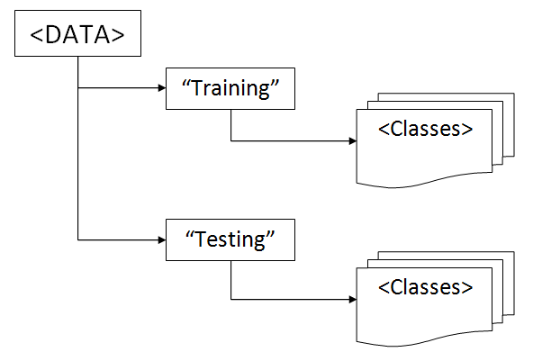

# How to use a project

There is three independent projects:

* MoCap
* Kinect
* Emotion

To run one of them,

1. As in [Quick start](#quick-start), run `pip install -r requirements.txt`. If something goes wrong, install manually [obligatory Python packages](README.md#dependencies). 
2. If you're about to run MoCap project, you need to
    - get [permission](https://github.com/dizcza/GesturesSpeech/tree/dev/MOCAP/_data). Otherwise, only one c3d sample is available.
    - set up a path to the downloaded MoCap database.
	
	> Each `[PREFIX]reader.py` initializes a constant `PROJECTNAME_PATH` -- a path to data directory for the current PROJECTNAME, -- where [PREFIX] is the first character of the PROJECTNAME. So you have to change that constant. Keep in mind, that the chosen data directory should preserve the original structure, used in a project: 

3. Decide which project part do you want to run: 
	- `[PREFIX]reader.py` -- data demonstration (visualization);
	- `[PREFIX]setting.py` -- WDTW training;
	- `[PREFIX]test.py` -- WDTW testing.

	Whether it's a reader, setting or a testing script file, you can run it through Python IDE ([PyCharm](https://www.jetbrains.com/pycharm/) is used here) or via cmd by typing `$ python -m PROJECTNAME.filename` (without a `.py`) inside a global project directory, which is  `GesturesSpeech` -- repository name. For example, type
  
		$ python -m Kinect.kreader
  
	to run Kinect demo.

The project is portable: both Windows 7 and Linux are supported. Also you can easily switch from Python 2.7 to Python 3.4 and vice versa.

If you use Python 2.7, make sure you don't have non-ascii characters in your path to clone the project in. Some python-2.7 modules (such as [pyglet](https://bitbucket.org/pyglet/pyglet/issues/74/pyglet-crashes-with-a-unicodeerror-on)) may not work with module param `-m` and non-ascii characters in path at the same time.